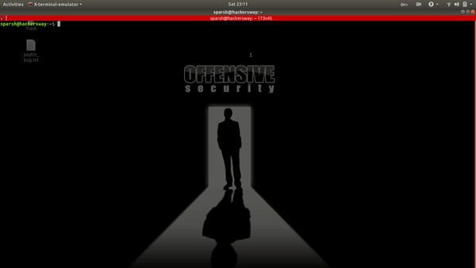

# LazyRecon

Subdomain discovery using Sublist3r, certspotter, crt.sh , censys and amass and Subdomain bruteforcing using Gobuster.

# About
This script is intended to automate your reconnaissance process in an organized fashion by performing the following: 

Create a folder with recon notes 
Grab subdomains using Sublist3r , crt.sh , censys , subfinder and amass. 
Subdomain bruteforcing using Gobuster. 
Resolve hosts using tomnonnom's filter-resolved. 
Take http screenshot using EyeWitness. 

# Requirements
This requires following Bug Bounty Hunting Tools in your ~/Downloads/recon/passive directory for script to work. 

https://github.com/aboul3la/Sublist3r 
https://github.com/subfinder/subfinder 
https://github.com/christophetd/censys-subdomain-finder 
https://github.com/OJ/gobuster 
https://github.com/OWASP/Amass 
https://github.com/tomnomnom/hacks/tree/master/filter-resolved 
https://github.com/FortyNorthSecurity/EyeWitness 
<b>Wordlist used:</b>https://github.com/assetnote/commonspeak2-wordlists

# Warning: 
This code was originally created for personal use for myself, so it's a bit messy and hopefully it'll be cleaned up with more features in a later release.

# Demo:

# Whats New:
new tool added : subfinder. 
Now it will also take screenshots of found subdomains. 
Now it will use crt.sh instead of certspotter. 

# Inspired by:
https://twitter.com/armaancrockroax  
https://twitter.com/nahamsec  
